# 미니프로젝트 4차 7조 ai-book-manager

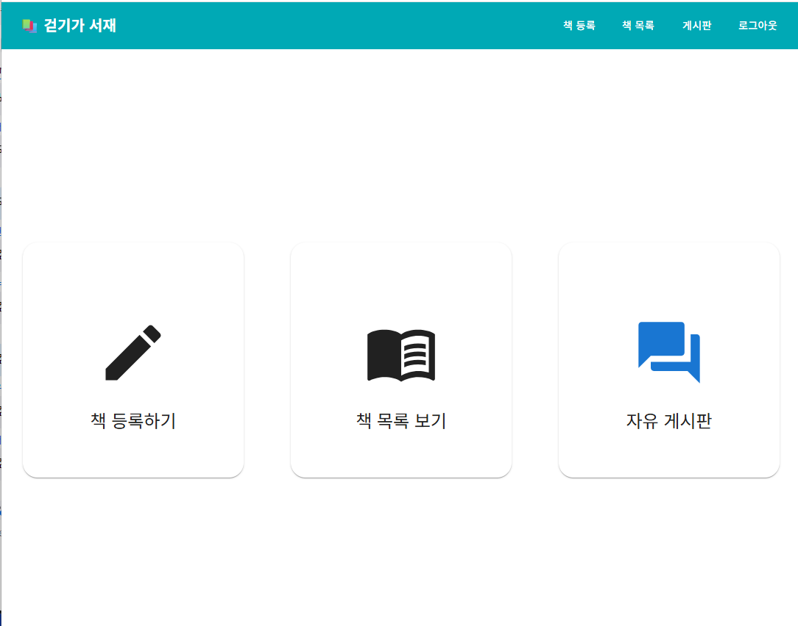

---
## 🎯 문제 정의

기존의 텍스트 중심 도서 관리는 직관성이 떨어짐   
수동으로 표지 이미지를 찾아 등록하는 것은 번거로운 작업

## 🎯 프로젝트 개요

누구나 글을 쓰고, AI의 도움으로 나만의 작품을 완성할 수 있도록 설계된 창작 플랫폼   
단순한 글 관리 도구를 넘어, AI와 함께 만드는 시각적 상상력을 제공     
일기부터 소설까지, AI는 사용자의 감정이 담긴 글에 어울리는 표지를 생성하며 감성적인 창작 경험을 완성

---

## 🛠️ 주요 적용 기술 및 구조

- #### 개발 환경: windows

- #### 개발 도구: vscode, Intellij, WebStorm 

- #### 개발 언어: JavaScript, Java, Python

- #### 주요 기술 스택: Vite, React, MUI, Spring Boot, Spring MVC/JPA, Lombok, OpenAI API
  
- ### 파일 구조
```
  ai-book-manager/
  ├── backend/           # Spring Boot 기반 서버
  │   ├── board/
  │   │   ├── controller/
  │   │   ├── domain/
  │   │   ├── dto/
  │   │   ├── repository/
  │   │   └── service/
  │   ├── book/
  │   │   ├── controller/
  │   │   ├── domain/
  │   │   ├── dto/
  │   │   ├── repository/
  │   │   └── service/
  │   ├── config/
  │   │   ├── JwtAuthenticationFilter/
  │   │   ├── JwtTokenProvider/
  │   │   ├── SecurityConfig/
  │   │   └── WebConfig/
  │   ├── exception/
  │   │   ├── BookNotFoundException/
  │   │   ├── CustomException/
  │   │   ├── GlobalExceptionHandler/
  │   │   └── UserNotFoundException/
  │   ├── security/
  │   │   ├── CustomUserDetails/
  │   │   └── CustomUserDetailsService/
  │   └── user/
  │   │   ├── controller/
  │   │   ├── dto/
  │   │   ├── entity/
  │   │   ├── repository/
  │   │   └── service/
  ├── bookproject/       # React 기반 프론트엔드
  │   ├── api/
  │   │   ├── boardApi.js/
  │   │   ├── bookApi.js/
  │   │   └── replyApi.js/
  │   ├── components/
  │   │   ├── Header.jsx/
  │   │   └── ProtectedRoute.jsx/
  │   └── pages/
  │   │   ├── AiBookCover.jsx/
  │   │   ├── BoardDetail.jsx/
  │   │   ├── BoardList.jsx/
  │   │   ├── BoardUpdate.jsx/
  │   │   ├── BoardWrite.jsx/
  │   │   ├── BookCreate.jsx/
  │   │   ├── BookDetail.jsx/
  │   │   ├── BookList.jsx/
  │   │   ├── BookUpdate.jsx/
  │   │   ├── Login.jsx/
  │   │   ├── Main.jsx/
  │   │   └── Register.jsx/
  └── README.md
```

- ### 시스템 구조도
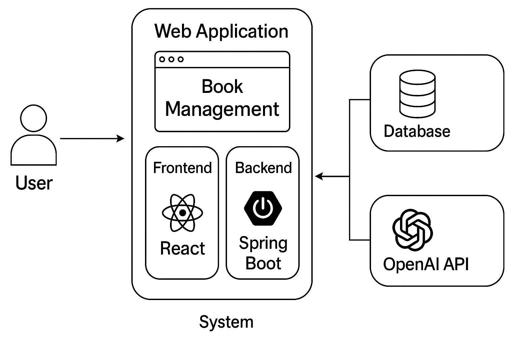

---

## ✨ 주요 기능

- **회원가입 & 로그인**  
  JWT를 활용하여 사용자 인증
  
- **도서 목록 확인**  
  목록에는 카테고리, 도서 제목, 도서 저자, 좋아요 수, 작성자, 책 표지 표시
  
- **신규 도서 등록**  
  신규 도서 등록 버튼 제공   
  제목, 내용, 입력 필드 구성   
  유효성 검사

- **도서 상세 정보 조회**  
  도서 목록에는 리스트 형태로 구성하여 클릭 시 상세 페이지로 이동   
  표지, 작성일, 본문 내용 포함

- **도서 수정 및 삭제**  
  [수정] 버튼 클릭 시 기존 정보 불러오기 및 수정 후 저장 가능   
  [삭제] 버튼 클릭 시 확인 알림 후 제거   
  삭제 시 목록에서도 즉시 반영
  
 - **AI 표지 이미지 생성**  
  AI 이미지 생성 버튼또는 자동 생성 트리거   
  도서 내용 기반 키워드 추출 -> 이미지 생성   
  표지 미리보기 및 재생성 기능   
  생성된 표지는 상세페이지 및 목록에 자동 반영
  ---

## 📸 프로젝트 구현 화면
**로그인**   


**회원가입**   
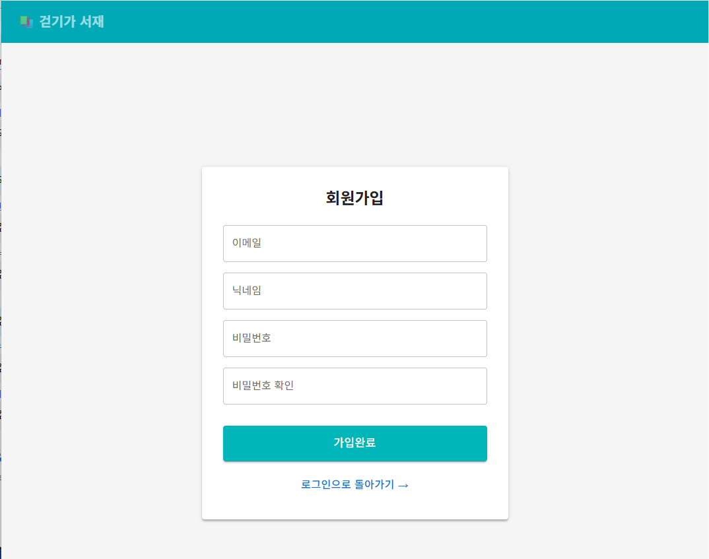


**메인**   


**책 등록**   
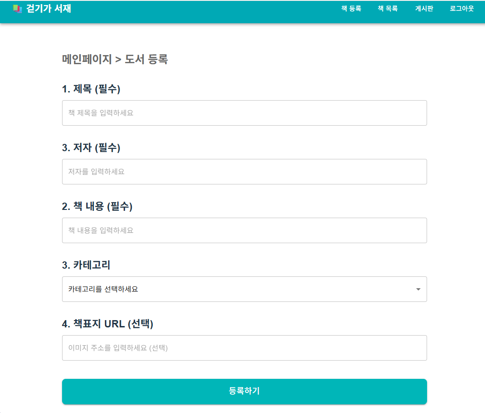


**책 목록**   
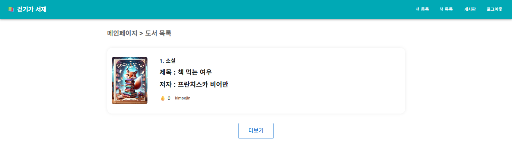


**책 상세보기**   
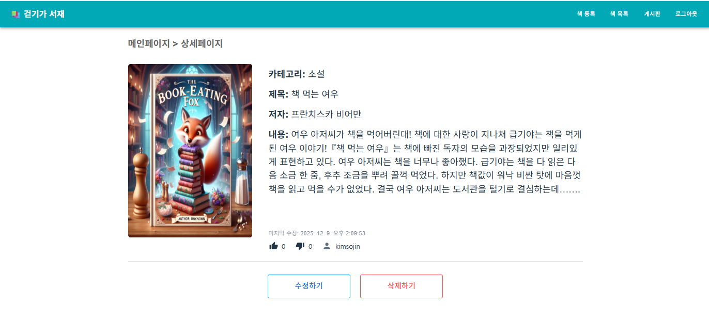


**책 수정**   
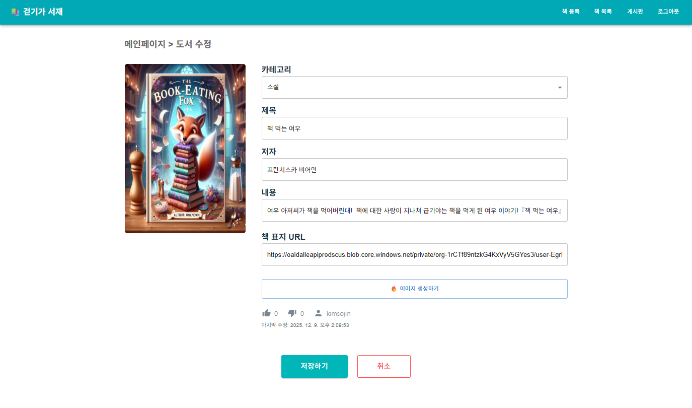


**책 표지 생성**   
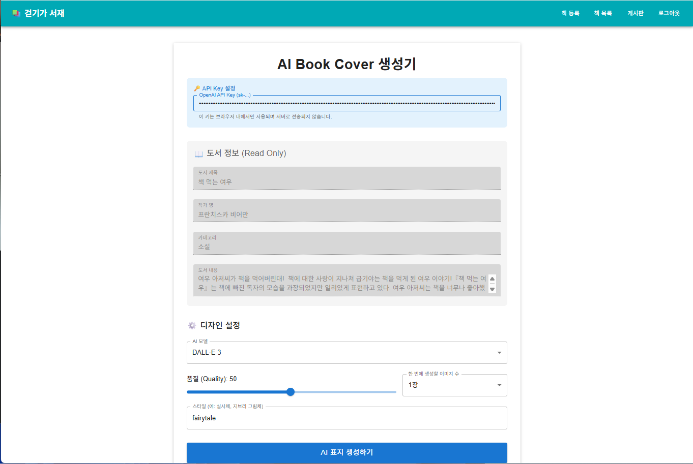


**책 표지 생성 완료**   


**게시판 목록**   
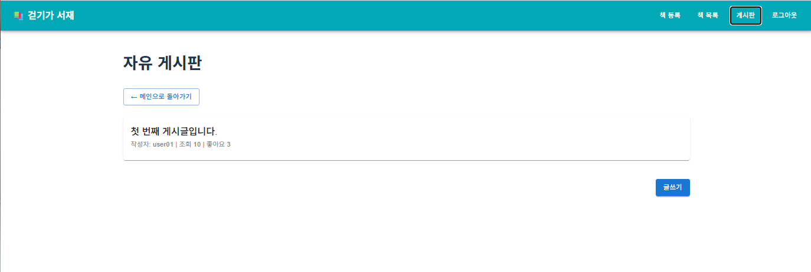


**게시판 글쓰기**   
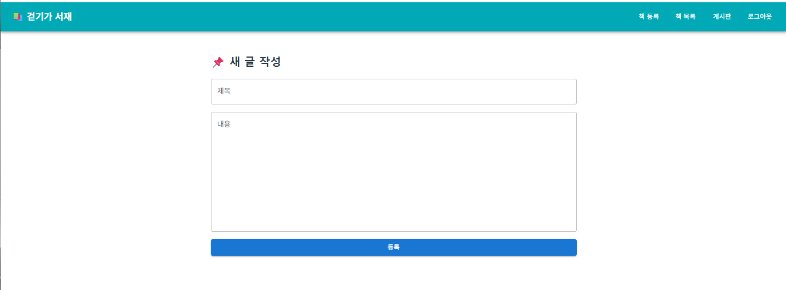


**게시판 상세조회**   
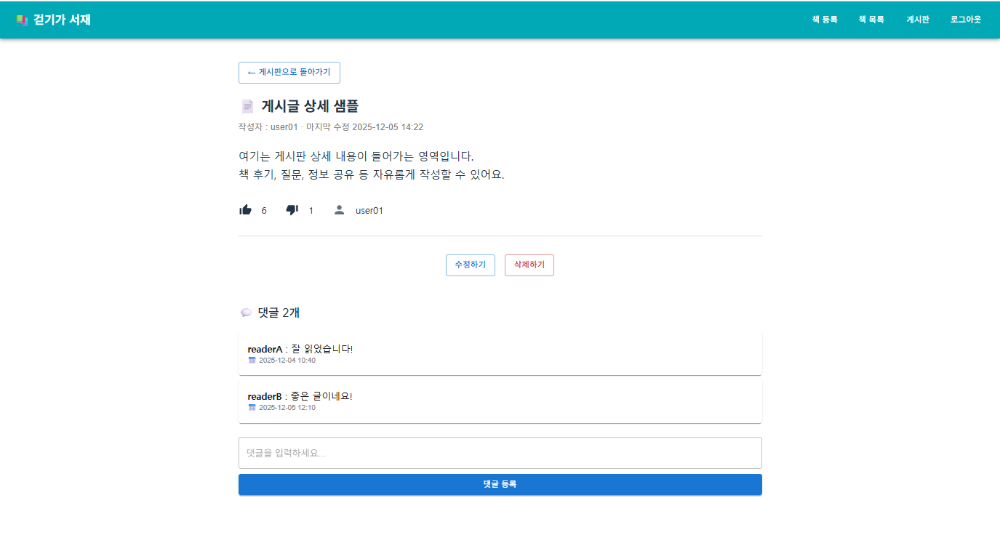


**게시판 수정**   
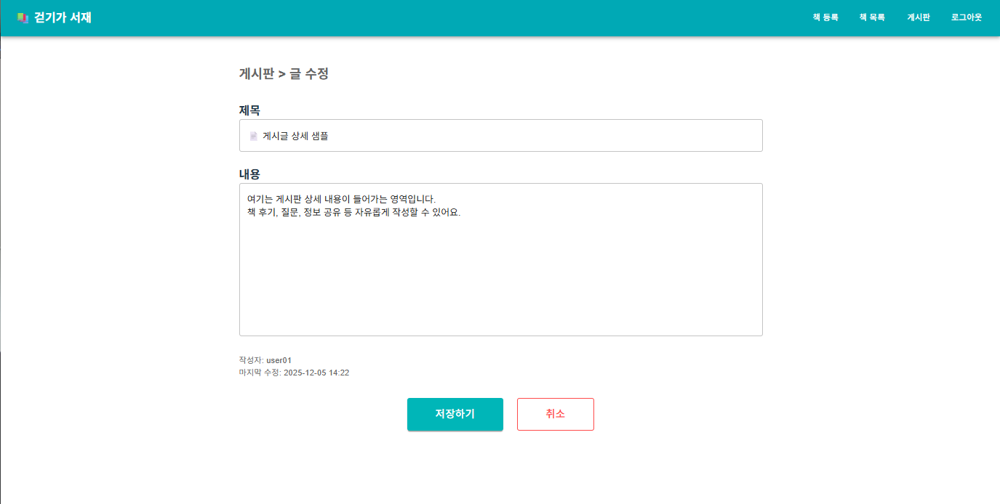
